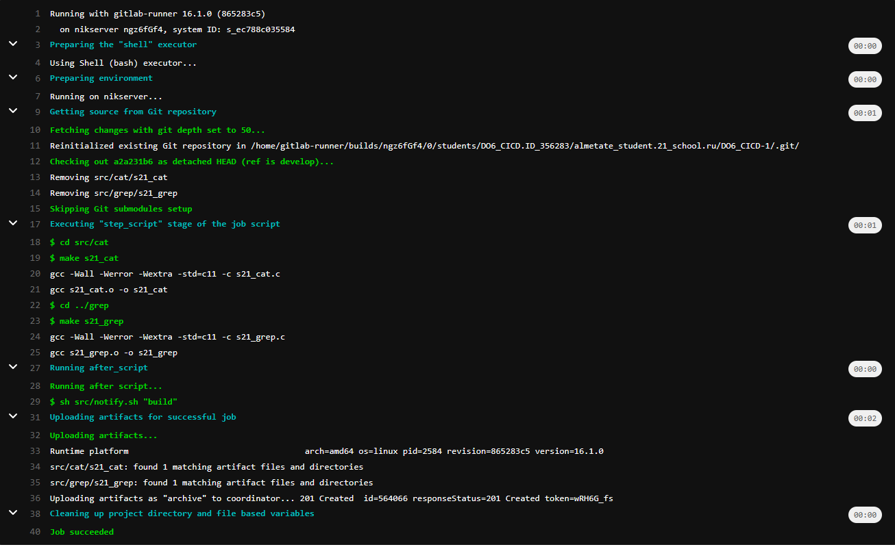

Разработка простого **CI/CD** для проекта на виртуальной машине Ubuntu Server. Сборка, тестирование, развертывание.
## 1. Поднятие виртуальной машины Ubuntu Server 20.04 и настройка общей папки с основной машиной
1. [скачиваем](https://www.virtualbox.org/wiki/Downloads) программу VirtualBox
2. [скачиваем](https://ubuntu.com/download/server#downloads) образ сервера Ubuntu Server LTS 20.04.6
3. устанавливаем и поднимаем виртуальную машину Ubuntu Server
4. создаем общую папку на основной и виртуальной машине и создаем общий буффер обмена при копировании текста в терминал сервера, для этого на виртуальной машине установим дополнения гостевой системы (потребуется кукуево места):
* `sudo apt-get update`
* `sudo apt-get install virtualbox-guest-dkms`
* `sudo apt-get install virtualbox-guest-utils`
* `sudo adduser $USER vboxsf`
* `sudo apt-get install virtualbox-guest-additions-iso`
В настройках Virtualbox данной машины создаем общую папку и делаем `reboot` виртульной машины после чего в папке `/media/` появляется эта папка с локальной машины где можно обмениваться файлами

## 1. установка и регистрация gitlab-runner

* `curl -L "https://packages.gitlab.com/install/repositories/runner/gitlab-runner/script.deb.sh" | sudo bash`
* `sudo apt-get install gitlab-runner`

регистрация гитлаб раннер

* `sudo gitlab-runner register``
```
    URL: https://repos.21-school.ru
    token: <your_token_from_the_platform>
    -
    tags: build,style,test,deploy
    -
    executor: shell
```
Проверка (должно быть is_alive):
* `$ sudo gitlab-runner verify`

## 2. создание файла `.gitlab-ci.yml`

В корне проекта создаем файл `.gitlab-ci.yml` записываем соответствующие stages. Важно в каждом stage указать `tags` иначе раннер не будет знать где их запускать и ничего не получиться.
перед этапом deploy создаем вторую виртуальную машину убунту. Затем для передачи исполняемых файлов на вторую машину по ssh нужно предварительно их связать. Для этого закроем обе машины и в настройках виртуалбокс машин в настройках "сеть" создадим второй адаптер и выберем внутренюю сеть. После этого изменяем настройки файла `/etc/netplan/00-installer-config.yaml` в соотвествии с рисунком и сделаем `sudo netplan apply` и пропингуем машины друг с другом что бы убедиться что между ними возникла связь:


Убедившись что все норм, в первой машине заходим из-под пользователя gitlab-runner `sudo su - gitlab-runner`, создадим ssh-ключ и скопируем на вторую машину `ssh-keygen` `ssh-copy-id almetate@10.10.0.2` и на второй машине дадим права для папки `/usr/local/bin/` командой `sudo chmod -R 777 /usr/local/bin`

деплой мы установим ручной и когда запушим изменения в гитлабе нам нужно будет запустить деплой вручную.

## 3. уведомления посредство telgram bot

создадим скрипт `notify.sh`
в дальнейшем нам надо будет получить свой id c помощью бота @GetMyIDBot и токен с помощью @BotFather. Вставляем соответствующие ID и токен сохраняем изменения, пушим и получаем сообщения в телеграмм от бота об успешности этапов:


не забываем добавить выполнения этого скрипта в основной конфигурационный файл после выполнения этапа в независимости от успеха этапа.

при этом в гитлабе можно будет уведитеть как там и что выполнялось на каждом этапе:
### BUILD

### STYLE

### TEST

### DEPLOY


для проверки попробуем специально совершить ошибку в стилистике файла и увидим что stage `style` фэйлится в пейплайн выходит текст где находится ошибка и дальше stage не запускается:
